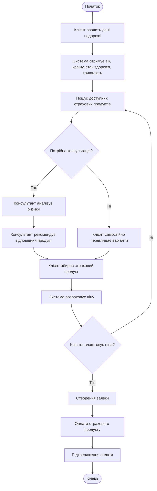

# Діаграма активності пошуку, вибору за участю консультанта та оплати

```mermaid
flowchart TD
    A([Початок]) --> B[Клієнт вводить дані подорожі]
    B --> C[Система отримує вік, країну, стан здоров'я, тривалість]
    C --> D[Пошук доступних страхових продуктів]
    D --> E{Потрібна консультація?}
    E -- Так --> F[Консультант аналізує ризики]
    F --> G[Консультант рекомендує відповідний продукт]
    E -- Ні --> H[Клієнт самостійно переглядає варіанти]
    G --> I[Клієнт обирає страховий продукт]
    H --> I
    I --> J[Система розраховує ціну]
    J --> K{Клієнта влаштовує ціна?}
    K -- Ні --> D
    K -- Так --> L[Створення заявки]
    L --> M[Оплата страхового продукту]
    M --> N[Підтвердження оплати]
    N --> O([Кінець])
```
