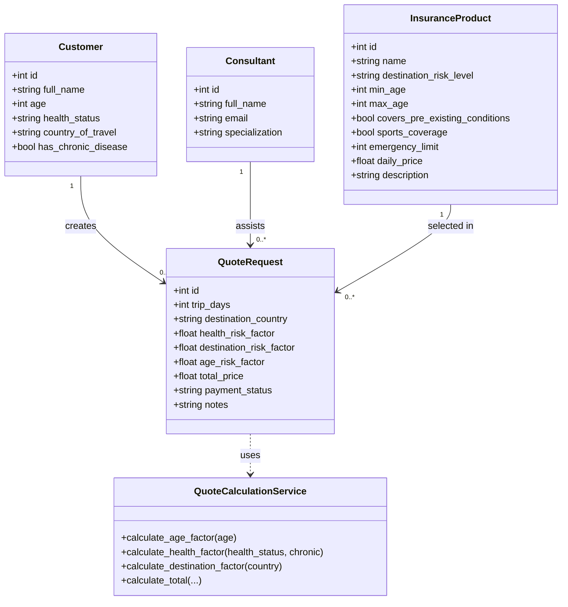

# Діаграма класів системи пошуку страхових продуктів

```mermaid
classDiagram
    class Customer {
        +int id
        +string full_name
        +int age
        +string health_status
        +string country_of_travel
        +bool has_chronic_disease
    }

    class Consultant {
        +int id
        +string full_name
        +string email
        +string specialization
    }

    class InsuranceProduct {
        +int id
        +string name
        +string destination_risk_level
        +int min_age
        +int max_age
        +bool covers_pre_existing_conditions
        +bool sports_coverage
        +int emergency_limit
        +float daily_price
        +string description
    }

    class QuoteRequest {
        +int id
        +int trip_days
        +string destination_country
        +float health_risk_factor
        +float destination_risk_factor
        +float age_risk_factor
        +float total_price
        +string payment_status
        +string notes
    }

    class QuoteCalculationService {
        +calculate_age_factor(age)
        +calculate_health_factor(health_status, chronic)
        +calculate_destination_factor(country)
        +calculate_total(...)
    }

    Customer "1" --> "0..*" QuoteRequest : creates
    Consultant "1" --> "0..*" QuoteRequest : assists
    InsuranceProduct "1" --> "0..*" QuoteRequest : selected in
    QuoteRequest ..> QuoteCalculationService : uses
```
