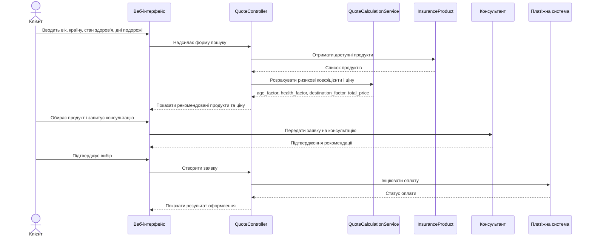

# Sequence діаграма вибору та розрахунку оплати за страховку

```mermaid
sequenceDiagram
    actor Client as Клієнт
    participant UI as Веб-інтерфейс
    participant Controller as QuoteController
    participant Service as QuoteCalculationService
    participant Product as InsuranceProduct
    participant Consultant as Консультант
    participant Payment as Платіжна система

    Client->>UI: Вводить вік, країну, стан здоров'я, дні подорожі
    UI->>Controller: Надсилає форму пошуку
    Controller->>Product: Отримати доступні продукти
    Product-->>Controller: Список продуктів
    Controller->>Service: Розрахувати ризикові коефіцієнти і ціну
    Service-->>Controller: age_factor, health_factor, destination_factor, total_price
    Controller-->>UI: Показати рекомендовані продукти та ціну

    Client->>UI: Обирає продукт і запитує консультацію
    UI->>Consultant: Передати заявку на консультацію
    Consultant-->>UI: Підтвердження рекомендації

    Client->>UI: Підтверджує вибір
    UI->>Controller: Створити заявку
    Controller->>Payment: Ініціювати оплату
    Payment-->>Controller: Статус оплати
    Controller-->>UI: Показати результат оформлення
```
