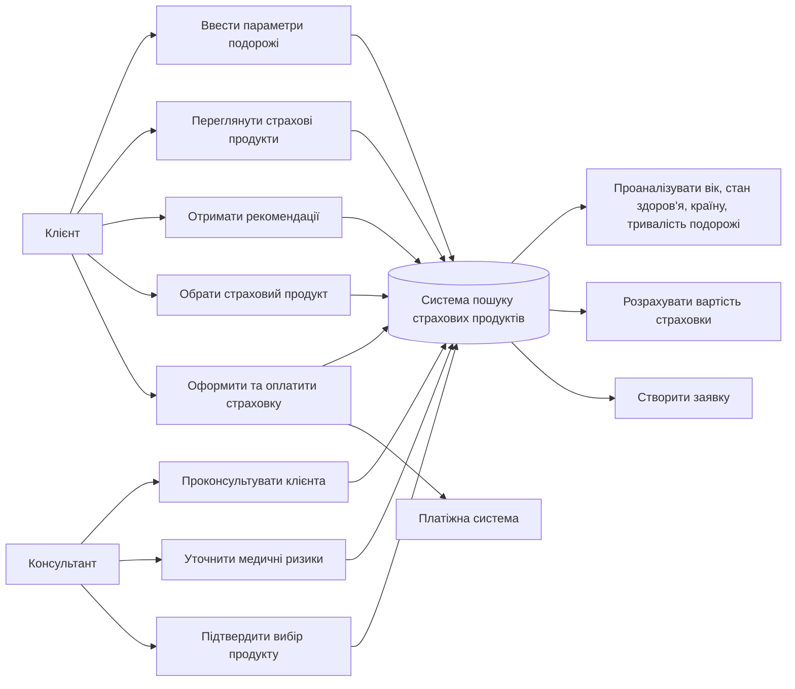

# Use-Case діаграма пошуку страховки для поїздки у відпустку в країну з високим ризиком для здоров'я

```mermaid
flowchart LR
    Client[Клієнт]
    Consultant[Консультант]
    System[(Система пошуку страхових продуктів)]
    Payment[Платіжна система]

    Client --> UC1[Ввести параметри подорожі]
    Client --> UC2[Переглянути страхові продукти]
    Client --> UC3[Отримати рекомендації]
    Client --> UC4[Обрати страховий продукт]
    Client --> UC5[Оформити та оплатити страховку]

    Consultant --> UC6[Проконсультувати клієнта]
    Consultant --> UC7[Уточнити медичні ризики]
    Consultant --> UC8[Підтвердити вибір продукту]

    UC1 --> System
    UC2 --> System
    UC3 --> System
    UC4 --> System
    UC5 --> System
    UC6 --> System
    UC7 --> System
    UC8 --> System

    System --> UC9[Проаналізувати вік, стан здоров'я, країну, тривалість подорожі]
    System --> UC10[Розрахувати вартість страховки]
    System --> UC11[Створити заявку]

    UC5 --> Payment
```
